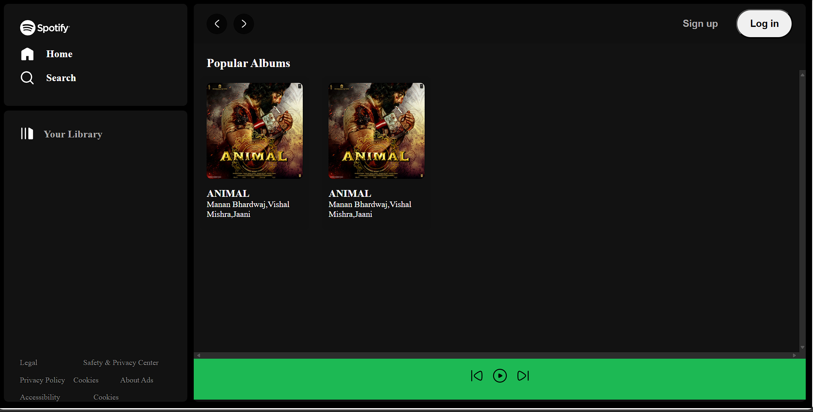

# Spotify Clone

This is a clone of the Spotify Web Player created using HTML, CSS, and some JavaScript. It replicates the look and feel of Spotify's interface, including navigation, album display, and a song control bar.

## Live Demo

You can view the live demo of the project [here](https://sridharreddyadina.github.io/Spotify_Clone/).

## Screenshots



## Features

- **Navigation Bar**: Includes links to Home, Search, and Your Library.
- **Popular Albums Section**: Displays a list of popular albums with play buttons.
- **Songbar**: Contains song control buttons (previous, play, next).

## Technologies Used

- HTML
- CSS

## Getting Started

To get a local copy up and running follow these simple steps.

### Prerequisites

You need a web browser to view the project. For local development, ensure you have a code editor like VSCode.

### Installation

 1. Clone the repository:
   ```bash
   git clone https://github.com/sridharreddyadina/Spotify_Clone.git
```
 2. Navigate into the project directory:
```bash
cd Spotify_Clone
```
3. Open `index.html` in your web browser to view the project.

## Project Structure
- `index.html`: The main HTML file containing the structure of the web player.
- `style.css`: Contains the main CSS styling for the project.
- `utility.css`: Contains utility classes for layout and styling.
- `assets/`: Contains image assets used in the project.
